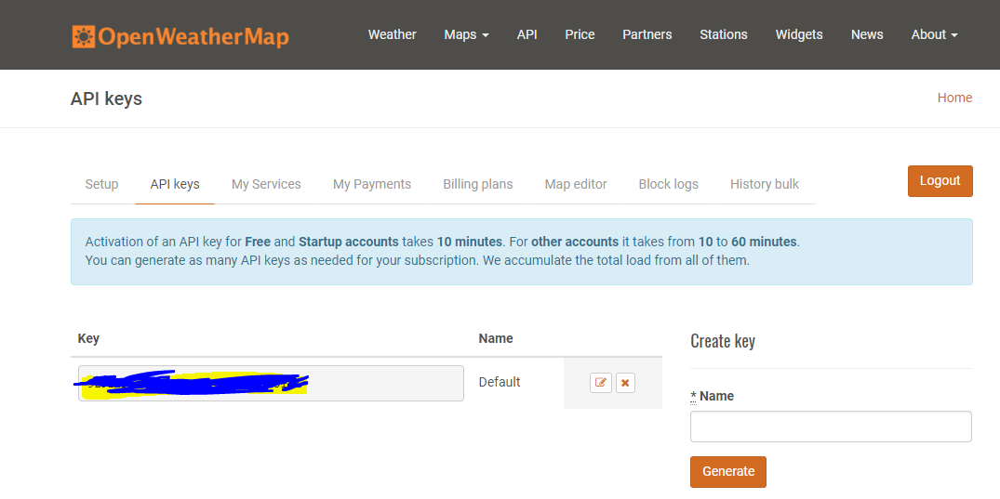

# vue-weather-app

- Vue 날씨 웹 앱
- IDE : WebStorm 사용
- node.js : 8.9.3
- npm : 6.2.0
- vue-cli : 2.9.6

1. https://bitbucket.org/phpbae/vue-weather-app/src/master/
2. git clone https://phpbae@bitbucket.org/phpbae/vue-weather-app.git
3. 프로젝트 구성 vue-cli 를 이용하여, 제공해주는 템플릿을 이용(webpack) - vue init webpack vue-weather-app
```
vue list

 ★  browserify - A full-featured Browserify + vueify setup with hot-reload, linting & unit testing.
 ★  browserify-simple - A simple Browserify + vueify setup for quick prototyping.
 ★  pwa - PWA template for vue-cli based on the webpack template
 ★  simple - The simplest possible Vue setup in a single HTML file
 ★  webpack - A full-featured Webpack + vue-loader setup with hot reload, linting, testing & css extraction.
 ★  webpack-simple - A simple Webpack + vue-loader setup for quick prototyping.
```

## 날씨 API 이용하기
1. https://openweathermap.org/  -> 이 사이트 가입해서, API Key 발급받아야함
2. 가입 후, 상위 메뉴 API 클릭 후, Current weather data -> 구독 버튼 클릭
3. Free 에서 "Get API Key and Start" 버튼 클릭
4. Sign up 클릭
5. 결과



```
api call

api.openweathermap.org/data/2.5/weather?q={city name},{country code}
예) api.openweathermap.org/data/2.5/weather?q=London,uk

Incheon, KR

Current weather data
참고 : https://openweathermap.org/current
참고2 : https://openweathermap.org/weather-data

How to use API key in API call
Description:
To get access to weather API you need an API key whatever account you chose from Free to Enterprise.

Activation of an API key for Free and Startup plans takes 10 minutes. For other tariff plans it is 10 to 60 minutes.

We keep right to not to process API requests without API key.

API call:
http://api.openweathermap.org/data/2.5/forecast?id=524901&APPID={APIKEY}
Parameters:
APPID {APIKEY} is your unique API key 
Example of API call:
api.openweathermap.org/data/2.5/forecast?id=524901&APPID=1111111111 

My endpoint
- http://api.openweathermap.org/data/2.5/weather?q=Incheon,kr&appid=
param : q / appid

- http://api.openweathermap.org/data/2.5/weather?lat=&lon=&appid=
param : lat / lon / appid

```

## axios 설치

- Vue는 화면에 대한 책임만 있기 때문에, HTTP 통신을 대신 해주는 axios를 사용해야함. 
- vue-resource 도 있지만, 왜 사용안할까? 에번 유가 공식적으로 추천하지 않는 프로젝트 + 업데이트가 되지 않고 있음.
- npm i --save axios
- main.js 를 열어 axios를 추가하고  vue 전역으로 사용할 수 있도록 해주자

## vuex 설치

- Vue 상태 관리를 위해 설치.
- npm i --save vuex
- store.js 파일 작성
- vuex 를 사용가능하게 등록해주자.

## vue-icon 및 vuetify 설치

- vue CSS 프레임워크 및 UI를 위해 설치.
- npm i --save vuetify vue-icon

```
icon list
https://qinshenxue.github.io/vue-icon/

```

```
import Vue from 'vue'
import App from './App'
import router from './router'
import axios from 'axios'
import store from './store'

Vue.use(axios)

Vue.config.productionTip = false

/* eslint-disable no-new */
new Vue({
  el: '#app',
  router, store,
  components: { App },
  template: '<App/>'
})
```


## moment 및 vue-moment-js 설치

- JS 에서 유명한, DATE 라이브러리 moment.js 설치
- moment.js 는 DATE 형식 / 날짜 계산 등을 간편하게 할 수 있도록 해줌.
- npm i --save moment
- npm i --save vue-moment-js

```
적용
main.js

import moment from 'moment'
import vueMoment from 'vue-momentjs'

Vue.use(vueMoment, moment)

사용
this.$moment()

다양한 사용방법
참조 : https://momentjs.com/ 

```

## 빌드 및 배포

```
- Heroku ?
헤로쿠는 웹 애플리케이션 배치 모델로 사용되는 여러 프로그래밍 언어를 지원하는 클라우드 PaaS이다. 
최초의 클라우드 플랫폼들 가운데 하나인 헤로쿠는 2007년 6월 개발이 시작되었고 당시에는 루비 프로그래밍 언어만 지원하였으나 
지금은 자바, Node.js, 스칼라, 클로저, 파이썬, PHP, 고를 지원한다.
PaaS(Platform as a Service) : 기호에 맞춰 SW 개발 돕는, 개발자를 위한 서비스

- Heroku 를 이용.
참조 : https://medium.com/netscape/deploying-a-vue-js-2-x-app-to-heroku-in-5-steps-tutorial-a69845ace489


https://www.heroku.com/ 
1. 가입하여, heroku app 생성해야함.
헤로쿠의 가입은 무료이며, 유료로 전환이 가능합니다. 현재 무료 버전의 제약은 크게 2가지입니다.
30분간 방문이 없는 경우 사이트를 sleep시킵니다. 사이트가 sleep된 상태에서 페이지 요청이 들어오는 경우 사이트가 다시 깨어나지만 10~30 정도 시간이 걸립니다.
한 계정당 한달의 550시간만 사용가능합니다. 단 계정에 신용카드 등록을 하는 경우 1000시간 사용가능합니다.한달은 최대 744시간이므로 신용카드 등록을 한다면 하나의 사이트를 한달 내내 돌려도 시간 한도를 넘어가지 않습니다. 사이트가 여러개라서 시간이 초과되면 사이트에 더이상 접속할 수 없습니다.
두가지 제약이 있지만 연습용, 발표용, 포트폴리오용으로는  무료버전도 충분

2. heroku CLI 다운로드 또는 웹 콘솔로 작업해도 된다.
https://devcenter.heroku.com/articles/heroku-cli

vue-weather-web-app 이름으로 생성.
https://<YOUR-PROJECT-NAME-HERE>.herokuapp.com

heroku login
heroku config:set NODE_ENV=production --app <YOUR-PROJECT-NAME-HERE>
heroku git:remote --app <YOUR-PROJECT-NAME-HERE>


3. 노드 express 서버 생성(server.js 작성)
npm install --save-dev express serve-static

- server.js 작성
const express = require('express');
const serveStatic = require("serve-static");
const history = require('connect-history-api-fallback');
const path = require('path');

const app = express();
app.use(history());
app.use(serveStatic(__dirname + "/dist"));

const port = process.env.PORT || 5000;
app.listen(port, function () {
  console.log('server started '+ port)
});

4. npm run build
- build를 하면, dist 폴더에 결과물을 생성

5. node server.js 
- 익스프레스를 실행시켜서, 빌드한 결과물이 로컬에서 정상적으로 동작하는지 확인

6. package.json 에 scripts 추가
"start": "node server.js"
-> Heroku는 node.js 앱을 실행하는 방법을 찾을 때이 스크립트를 자동으로 찾습니다.

7. git 관련 설정
- Add Your Heroku Remote Repository
heroku git:remote --app <YOUR-PROJECT-NAME-HERE>

.gitigore 파일에서
dist/  
위 내용을 삭제해 주자.

git add . && git commit -a -m "Adding files."

8. push & deploy
git push heroku master

- 만약 안되면, 나같은 경우 툴에서 강제 푸쉬해서 밀어넣었다.

이것은 우리의 커밋 된 코드를 취하여 Heroku의 원격 저장소로 보내고
start 명령을 실행(pacakage.json에 작성한)
그리고, 빌드된 dist 폴더를 express 서버에 올라갑니다.
문제가 생기면 언제든지 heroku logs 를 해결할 수 있습니다 .
배포가 성공적이면 프로젝트의 URL을 테스트 https://<YOUR-PROJECT-NAME-HERE>.herokuapp.com 하면 완료됩니다.

```

---

## vue-weather-app

> A Vue.js project

## Build Setup

``` bash
# install dependencies
npm install

# serve with hot reload at localhost:8080
npm run dev

# build for production with minification
npm run build

# build for production and view the bundle analyzer report
npm run build --report

# run unit tests
npm run unit

# run e2e tests
npm run e2e

# run all tests
npm test
```

For a detailed explanation on how things work, check out the [guide](http://vuejs-templates.github.io/webpack/) and [docs for vue-loader](http://vuejs.github.io/vue-loader).
